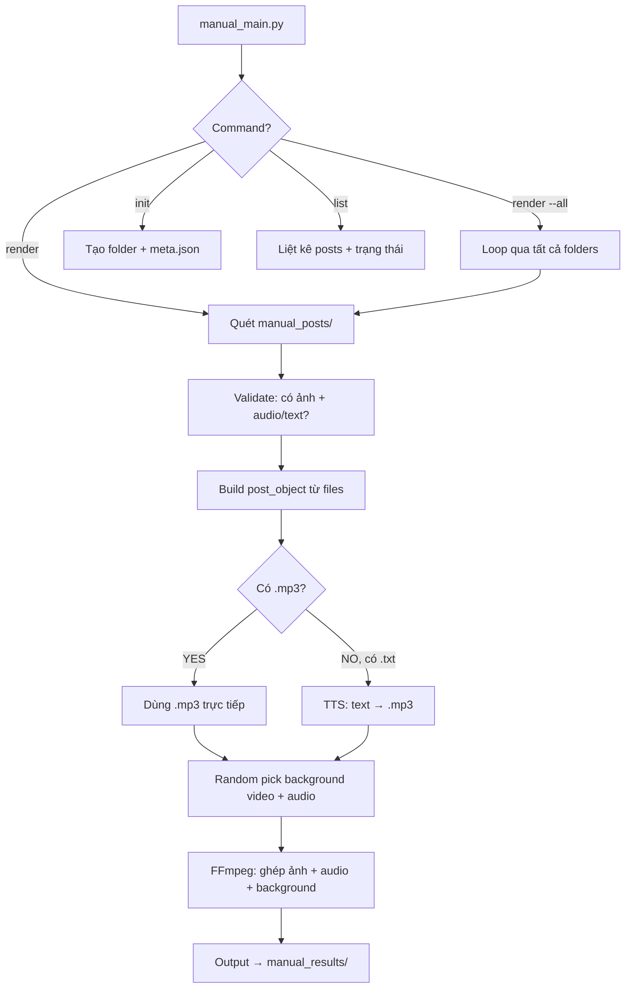

# 🧠 Brainstorming: Manual Screenshot → Video Pipeline

> **Bối cảnh**: Không thể sử dụng Reddit API. Cần workflow mới cho phép user tự chụp screenshot từ **Reddit, Threads (Meta), X (Twitter)** rồi hệ thống tự động tạo video.
> 
> **Trạng thái**: ✅ **ĐÃ IMPLEMENT** — Phase 1 hoàn tất.

---

## 1. Phân Tích Vấn Đề Cốt Lõi

### Flow hiện tại đang phụ thuộc Reddit API ở đâu?

| Bước | Phụ thuộc API? | Chi tiết |
|------|:---:|----------|
| Lấy thread + comments | ✅ **YES** | `reddit/subreddit.py` — PRAW login, fetch post, filter comments |
| **Text cho TTS** | ✅ **YES** | `TTS/engine_wrapper.py` — lấy text từ `reddit_object["comments"]` |
| **Screenshot** | ✅ **YES** | `screenshot_downloader.py` — Playwright login Reddit, navigate, capture |
| Background video/audio | ❌ NO | `background.py` — chỉ dùng YouTube, không liên quan Reddit |
| Final video assembly | ❌ NO | `final_video.py` — chỉ dùng FFmpeg, nhưng cần `reddit_obj` dict |
| Video tracking | ❌ NO | `videos.json` — chỉ lưu metadata |

**Kết luận**: Cần thay thế hoàn toàn **3 bước đầu** (fetch → TTS text → screenshot) bằng flow thủ công.

---

## 2. Phương Án Đã Chọn: **.mp3 ưu tiên, .txt fallback**

User cung cấp **file audio (.mp3) trực tiếp** + screenshots. TTS chỉ là fallback nếu chỉ có file `.txt`.

```
User chụp screenshot + cung cấp audio .mp3 → Video
                       (hoặc .txt fallback → TTS → Video)
```

### Ưu tiên audio:

```
Có .mp3?  ──YES──▶  Dùng .mp3 trực tiếp (bỏ qua TTS)
    │
    NO
    │
Có .txt?  ──YES──▶  TTS sinh .mp3 từ text (fallback)
    │
    NO
    │
    ▼
  ⚠ SKIP (screenshot không có audio)
```

---

## 3. Cấu Trúc Đã Implement

### 3.1 Thư mục

```
RedditVideoMakerBot/
├── main.py                          # Flow cũ (giữ nguyên, không sửa)
├── manual_main.py                   # 🆕 Entry point cho flow mới
│
├── manual/                          # 🆕 Module flow mới (tách biệt hoàn toàn)
│   ├── __init__.py                  # Module docstring
│   ├── scanner.py                   # Quét folder, validate (.png + .mp3 + .txt)
│   ├── tts_processor.py             # Audio processor (.mp3 ưu tiên, TTS fallback)
│   └── video_builder.py             # FFmpeg pipeline (libx264 CPU)
│
├── manual_posts/                    # 🆕 Thư mục input
│   └── post_001/
│       ├── meta.json                # (optional) metadata
│       ├── 0_title.png              # Screenshot bài đăng
│       ├── 0_title.mp3              # Audio (pre-recorded)
│       ├── 1_comment.png            # Screenshot comment
│       └── 1_comment.mp3            # Audio comment
│
├── manual_results/                  # 🆕 Thư mục output
│   └── post_001.mp4
│
├── reddit/                          # Flow cũ (giữ nguyên)
├── TTS/                             # Shared — dùng chung TTS engines (fallback)
├── video_creation/                  # Flow cũ (giữ nguyên)
└── utils/                           # Shared — dùng chung utilities
```

### 3.2 Quy Tắc Đặt Tên File

```
<số_thứ_tự>_<loại>.<ext>
```

| Pattern | Ý nghĩa | Bắt buộc? |
|---------|----------|-----------|
| `0_title.png` | Screenshot bài đăng chính | ✅ Bắt buộc |
| `0_title.mp3` | Audio pre-recorded | ✅ (hoặc .txt) |
| `0_title.txt` | Text TTS fallback | Fallback |
| `1_comment.png` | Screenshot comment 1 | Optional |
| `1_comment.mp3` | Audio comment 1 | ✅ (hoặc .txt) |
| `meta.json` | Metadata | Optional |

### 3.3 `post_object` — Data Structure

```python
post_object = {
    "post_id": "post_001",
    "platform": "reddit",              # reddit | threads | x | other
    "title": "What's the most...",
    "author": "u/example_user",
    "url": "https://...",
    "post_dir": "manual_posts/post_001",
    
    "screenshots": [
        {
            "index": 0,
            "type": "title",
            "image_path": "manual_posts/post_001/0_title.png",
            "text": "",                         # Từ .txt (nếu có)
            "audio_path": "manual_posts/post_001/0_title.mp3",  # Từ .mp3
            "audio_duration": 3.5,              # Đo sau khi process
        },
        {
            "index": 1,
            "type": "comment",
            "image_path": "manual_posts/post_001/1_comment.png",
            "text": "",
            "audio_path": "manual_posts/post_001/1_comment.mp3",
            "audio_duration": 5.2,
        },
    ],
    
    "total_duration": 8.7,
    "output_path": "manual_results/post_001.mp4",
}
```

### 3.4 Flow Xử Lý



---

## 4. So Sánh Flow Cũ vs Flow Mới

| Aspect | Flow Cũ (`main.py`) | Flow Mới (`manual_main.py`) |
|--------|---------------------|---------------------------|
| **Data source** | Reddit API (PRAW) | Manual screenshots + audio files |
| **Screenshot** | Playwright auto-capture | User tự chụp |
| **Audio source** | TTS từ comment text | **User cung cấp .mp3** (hoặc .txt → TTS) |
| **Platform** | Chỉ Reddit | Reddit + Threads + X + any |
| **TTS engines** | Required | Optional (chỉ là fallback cho .txt) |
| **Background** | Hardcoded YouTube list | **Random từ local folder** (YouTube fallback) |
| **Encoder** | `h264_nvenc` (GPU) | `libx264` (CPU) |
| **Config** | `config.toml` (template-based) | `config.toml` `[manual]` section + built-in defaults |
| **Output** | `results/<subreddit>/` | `manual_results/` |
| **Tracking** | `videos.json` | `videos.json` (shared) |

---

## 5. Config

```toml
[manual]
input_dir = "manual_posts"
output_dir = "manual_results"
encoder = "libx264"
resolution_w = 1080
resolution_h = 1920
opacity = 0.9
background_video = "random"                        # "random" hoặc tên cụ thể (e.g. "minecraft")
background_audio = "random"                        # "random" hoặc tên cụ thể (e.g. "lofi")
background_video_dir = "assets/backgrounds/video"  # Thư mục chứa video nền local
background_audio_dir = "assets/backgrounds/audio"  # Thư mục chứa nhạc nền local
background_audio_volume = 0.15
max_video_length = 120
```

**Lưu ý**: Config `[manual]` là optional. Nếu không có, dùng built-in defaults.

### Background: Random từ local folder

Bỏ file video/audio nền vào thư mục → hệ thống random chọn mỗi lần render:
```
assets/backgrounds/video/   ← Bỏ file .mp4/.mkv/.webm/.avi/.mov vào đây
assets/backgrounds/audio/   ← Bỏ file .mp3/.wav/.ogg/.m4a/.flac vào đây
```
- **Có file local** → random chọn 1
- **Không có file local** → fallback tải từ YouTube (danh sách cũ)

TTS fallback dùng settings từ `[settings.tts]` (mặc định: GoogleTranslate, không cần API key).

---

## 6. Decisions Log

| Câu hỏi | Quyết định |
|----------|------------|
| Audio source | **.mp3 ưu tiên**, .txt fallback sang TTS |
| Background | **Random từ local folder**, YouTube fallback |
| Encoder | `libx264` (CPU) — không có GPU NVIDIA |
| Config | Section `[manual]` trong `config.toml` |
| Thumbnail | Bỏ qua |
| Video tracking | Chung file `videos.json` |
| OCR (Phase 2) | EN + VI, dùng EasyOCR |

---

## 7. Phases

| Phase | Trạng thái | Mô tả |
|-------|:---:|--------|
| **Phase 1: Core** | ✅ Done | .png + .mp3 → Video (+ .txt TTS fallback) |
| Phase 2: OCR | ⏳ Planned | Auto-read text từ screenshots (EN + VI) |
| Phase 3: GUI | ⏳ Planned | Flask web interface cho manual flow |

---

> 📝 **Tóm tắt**: Module `manual/` tách biệt hoàn toàn. Input chính: screenshots (.png) + audio (.mp3). TTS chỉ là fallback khi dùng .txt. Reuse background functions từ code cũ. Output video vào `manual_results/`. Platform-agnostic.
