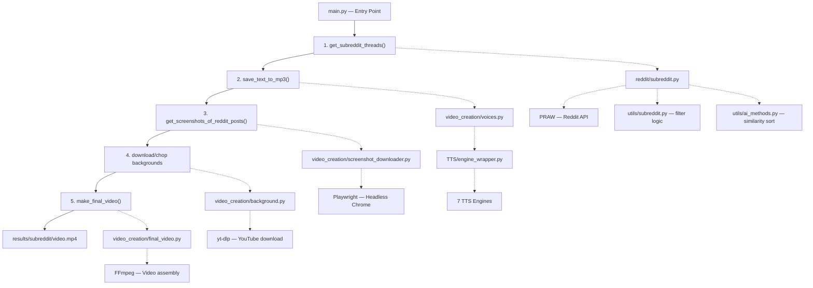
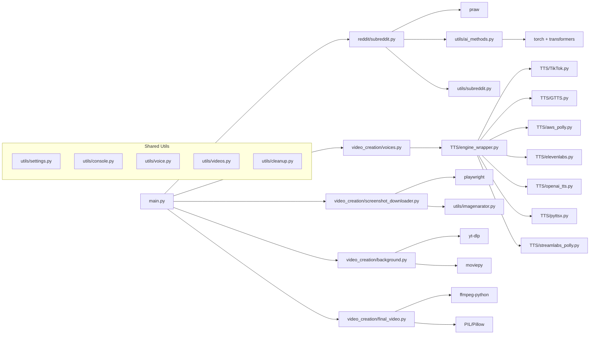

# 📦 RedditVideoMakerBot — Project Init Documentation

> **Version**: 3.4.0  
> **Author gốc**: Lewis Menelaws & [TMRRW](https://tmrrwinc.ca)  
> **License**: GPL + Roboto Fonts (Apache 2.0)  
> **Python**: 3.10 / 3.11 / 3.12  

---

## 1. Tổng Quan

RedditVideoMakerBot là một công cụ tự động hóa việc tạo video ngắn (TikTok/YouTube Shorts/Instagram Reels) từ các bài đăng trên Reddit. Bot sẽ:

1. **Lấy bài đăng** từ subreddit (qua Reddit API / PRAW)
2. **Chuyển text thành giọng nói** (TTS — 7 engine khác nhau)
3. **Chụp screenshot** bài đăng/comments bằng Playwright
4. **Tải & cắt video/audio nền** từ YouTube
5. **Ghép tất cả** thành video hoàn chỉnh bằng FFmpeg

Kết quả cuối cùng: file `.mp4` trong thư mục `results/<subreddit>/`.

---

## 2. Cấu Trúc Thư Mục

```
RedditVideoMakerBot/
├── main.py                         # 🚀 Entry point chính
├── GUI.py                          # 🖥️ Web GUI (Flask, port 4000)
├── config.toml                     # ⚙️ File cấu hình (user-generated)
├── ptt.py                          # 🔊 Helper script để liệt kê system voices
├── requirements.txt                # 📦 Python dependencies
├── Dockerfile                      # 🐳 Docker support (python:3.10-slim)
├── build.sh / run.sh / run.bat     # 📜 Scripts chạy nhanh
├── install.sh                      # 📜 Auto-installer (Linux/macOS)
│
├── reddit/                         # 📡 Module lấy dữ liệu từ Reddit
│   └── subreddit.py                #    Đăng nhập Reddit, lấy threads & comments
│
├── TTS/                            # 🗣️ Module Text-to-Speech (7 engines)
│   ├── engine_wrapper.py           #    TTSEngine — wrapper chung cho tất cả TTS
│   ├── TikTok.py                   #    TikTok TTS API
│   ├── aws_polly.py                #    AWS Polly (boto3)
│   ├── elevenlabs.py               #    ElevenLabs API
│   ├── openai_tts.py               #    OpenAI TTS API
│   ├── GTTS.py                     #    Google Translate TTS (gTTS)
│   ├── pyttsx.py                   #    pyttsx3 (offline, system voices)
│   └── streamlabs_polly.py         #    Streamlabs Polly
│
├── video_creation/                 # 🎬 Module tạo video
│   ├── voices.py                   #    Orchestrator — chọn TTS provider & chạy
│   ├── screenshot_downloader.py    #    Chụp screenshot Reddit bằng Playwright
│   ├── background.py               #    Tải & cắt background video/audio (yt-dlp)
│   ├── final_video.py              #    Ghép tất cả thành video (FFmpeg pipeline)
│   └── data/                       #    Cookie files + videos.json (tracking)
│       ├── cookie-dark-mode.json
│       ├── cookie-light-mode.json
│       └── videos.json
│
├── utils/                          # 🛠️ Utilities
│   ├── settings.py                 #    Đọc/validate config.toml theo template
│   ├── .config.template.toml       #    Template cấu hình (định nghĩa tất cả fields)
│   ├── console.py                  #    Rich console helpers (print_step, handle_input...)
│   ├── ai_methods.py               #    AI similarity sorting (sentence-transformers)
│   ├── subreddit.py                #    Logic chọn post chưa làm + bộ lọc
│   ├── voice.py                    #    sanitize_text(), rate limit, sleep_until()
│   ├── videos.py                   #    check_done(), save_data() — tracking
│   ├── cleanup.py                  #    Xóa temp files
│   ├── ffmpeg_install.py           #    Tự động cài FFmpeg nếu chưa có
│   ├── imagenarator.py             #    Render ảnh cho storymode method 1
│   ├── thumbnail.py                #    Tạo thumbnail cho video
│   ├── fonts.py                    #    Font size helpers
│   ├── id.py                       #    extract_id() — sanitize reddit thread ID
│   ├── posttextparser.py           #    Phân tách post text thành các đoạn
│   ├── playwright.py               #    Helper clear cookies
│   ├── version.py                  #    Check version mới trên GitHub
│   ├── gui_utils.py                #    Utils cho Flask GUI
│   ├── background_videos.json      #    Danh sách background videos (YouTube URLs)
│   └── background_audios.json      #    Danh sách background audios (YouTube URLs)
│
├── GUI/                            # 🌐 Flask Templates (HTML)
│   ├── layout.html                 #    Base template
│   ├── index.html                  #    Trang chủ — danh sách videos đã tạo
│   ├── settings.html               #    Trang cấu hình
│   ├── backgrounds.html            #    Quản lý backgrounds
│   └── voices/                     #    Voice sample files
│
├── fonts/                          # 🔤 Roboto font files
│   ├── Roboto-Regular.ttf
│   ├── Roboto-Bold.ttf
│   ├── Roboto-Medium.ttf
│   ├── Roboto-Black.ttf
│   └── LICENSE.txt
│
├── assets/                         # 🎨 Static assets
│   ├── title_template.png          #    Template ảnh cho fancy thumbnail
│   └── backgrounds/                #    Downloaded background files (video/audio)
│
├── results/                        # 📁 Output videos (auto-created)
│   └── <subreddit>/
│       ├── <video>.mp4
│       ├── OnlyTTS/                #    Video không có background audio
│       └── thumbnails/             #    Generated thumbnails
│
└── threads/                        # 📂 (Unused/placeholder)
```

---

## 3. Pipeline Xử Lý (Luồng Chính)



### Bước 1: Lấy Reddit Thread (`reddit/subreddit.py`)

- Đăng nhập Reddit qua **PRAW** (client_id, client_secret, username, password)
- Hỗ trợ **2FA** (nhập code thủ công)
- Chọn post theo các cách:
  - **Post ID cụ thể** (từ config, hỗ trợ nhiều ID phân cách bằng `+`)
  - **AI Similarity** — dùng `sentence-transformers/all-MiniLM-L6-v2` so sánh tương đồng với keywords
  - **Random** từ `subreddit.hot(limit=25)`
- **Bộ lọc** (trong `utils/subreddit.py`):
  - Skip posts đã làm (kiểm tra `videos.json`)
  - Skip NSFW (nếu `allow_nsfw = false`)
  - Skip pinned posts
  - Skip posts chứa **blocked words**
  - Skip posts ít hơn `min_comments`
  - Storymode: kiểm tra `selftext` length
- Thu thập comments (filter theo `min/max_comment_length`, skip deleted/removed/stickied)
- **Output**: Dict chứa `thread_url`, `thread_title`, `thread_id`, `is_nsfw`, `comments[]` hoặc `thread_post`

### Bước 2: Text-to-Speech (`video_creation/voices.py` + `TTS/`)

**7 TTS Providers** với `max_chars` khác nhau:

| Provider | Class | Max Chars | API Key Required | Notes |
|----------|-------|-----------|------------------|-------|
| **TikTok** | `TikTok` | 200 | Session ID | Dùng TikTok unofficial API |
| **Google Translate** | `GTTS` | 5,000 | Không | Dùng gTTS library |
| **AWS Polly** | `AWSPolly` | 3,000 | AWS Profile | Neural engine, 15 voices |
| **Streamlabs Polly** | `StreamlabsPolly` | 550 | Không | Free Polly wrapper |
| **ElevenLabs** | `elevenlabs` | 2,500 | API Key | Multilingual v1 model |
| **OpenAI** | `OpenAITTS` | 4,096 | API Key | tts-1, tts-1-hd, gpt-4o-mini-tts |
| **pyttsx3** | `pyttsx` | 5,000 | Không | Offline, system voices |

**TTSEngine wrapper** (`TTS/engine_wrapper.py`):
- Nhận reddit object → tạo MP3 cho title + mỗi comment
- Tự động **split** text dài hơn `max_chars` thành nhiều phần, dùng FFmpeg concat
- Thêm **silence** giữa các phần (`silence_duration`, mặc định 0.3s)
- Sanitize text: xóa URLs, ký tự đặc biệt, thay `+` → "plus", `&` → "and"
- Hỗ trợ **dịch** sang ngôn ngữ khác (qua `translators` library)
- Tính tổng `length` audio → dùng cho video length
- **Max video length**: mặc định 50 giây (hardcoded `DEFAULT_MAX_LENGTH`)
- **Output**: MP3 files trong `assets/temp/<thread_id>/mp3/`

### Bước 3: Screenshot Reddit Posts (`video_creation/screenshot_downloader.py`)

- Dùng **Playwright** (Chromium headless)
- **Login** vào Reddit (username/password)
- Truy cập thread URL trên `new.reddit.com`
- Hỗ trợ **Dark/Light/Transparent** theme (load cookies tương ứng)
- Chụp screenshot:
  - **Title** → `assets/temp/<id>/png/title.png`
  - **Comments** → `assets/temp/<id>/png/comment_<i>.png`
  - **Story content** → `assets/temp/<id>/png/story_content.png`
- Hỗ trợ **zoom** (scale browser)
- Hỗ trợ **dịch** text trước khi chụp
- Xử lý NSFW warning popup
- **Storymode method 1**: thay vì screenshot, dùng `imagemaker()` render ảnh từ text bằng PIL

### Bước 4: Background Video/Audio (`video_creation/background.py`)

**Background Videos** (10 options):
| Name | Source | Credit |
|------|--------|--------|
| minecraft | YouTube parkour | bbswitzer |
| minecraft-2 | YouTube | Itslpsn |
| gta | GTA stunt race | Achy Gaming |
| motor-gta | Bike parkour GTA | Achy Gaming |
| rocket-league | Rocket League | Orbital Gameplay |
| csgo-surf | CSGO Surf | Aki |
| cluster-truck | Cluster Truck | No Copyright Gameplay |
| multiversus | MultiVersus | MKIceAndFire |
| fall-guys | Fall Guys | Throneful |
| steep | Steep | joel |

**Background Audios** (3 options): `lofi`, `lofi-2`, `chill-summer`

- Tải bằng **yt-dlp** (chỉ lần đầu, cache ở `assets/backgrounds/`)
- **Cắt ngẫu nhiên** đoạn video/audio dài bằng video length
- Output: `assets/temp/<id>/background.mp4` và `background.mp3`

### Bước 5: Final Video (`video_creation/final_video.py`)

- **Concat** tất cả audio clips → `assets/temp/<id>/audio.mp3`
- **Merge** background audio (volume configurable, mặc định 0.15)
- **Prepare background**: crop video nền theo tỉ lệ `W/H` (mặc định 1080x1920 — portrait)
- **Tạo fancy thumbnail**: lấy `title_template.png`, stretch middle section, vẽ title text lên
- **Overlay** screenshots lên background video theo thời gian audio clips
  - Mỗi screenshot hiện trong khoảng thời gian tương ứng với audio clip của nó
  - Hỗ trợ `opacity` (mặc định 0.9)
- **Draw credit text** ở góc dưới phải
- **Render** bằng FFmpeg:
  - Codec: `h264_nvenc` (NVIDIA GPU acceleration)
  - Video bitrate: 20Mbps
  - Audio bitrate: 192kbps
  - Threads: `multiprocessing.cpu_count()`
- **Optional**: Render thêm bản "OnlyTTS" (không có background audio)
- **Save metadata** vào `videos.json`
- **Cleanup** temp files
- **Output**: `results/<subreddit>/<normalized_title>.mp4`

---

## 4. Cấu Hình (`config.toml`)

Cấu hình được validate tự động dựa trên template `utils/.config.template.toml`. Khi chạy lần đầu hoặc thiếu field, bot sẽ hỏi user nhập.

### `[reddit.creds]` — Thông tin đăng nhập Reddit
| Key | Type | Required | Mô tả |
|-----|------|----------|-------|
| `client_id` | string | ✅ | Reddit App ID (12-30 chars) |
| `client_secret` | string | ✅ | Reddit App Secret (20-40 chars) |
| `username` | string | ✅ | Tên đăng nhập Reddit (3-20 chars) |
| `password` | string | ✅ | Mật khẩu Reddit |
| `2fa` | bool | ❌ | Bật 2FA? Default: `false` |

### `[reddit.thread]` — Cấu hình bài đăng
| Key | Type | Default | Mô tả |
|-----|------|---------|-------|
| `subreddit` | string | — | Subreddit name (hỗ trợ `+` cho nhiều sub) |
| `post_id` | string | `""` | Post ID cụ thể (hỗ trợ `+` cho nhiều ID) |
| `random` | bool | `false` | Random thread? |
| `max_comment_length` | int | `500` | Max ký tự/comment |
| `min_comment_length` | int | `1` | Min ký tự/comment |
| `post_lang` | string | `""` | Ngôn ngữ dịch (VD: `vi`, `es`, `ja`) |
| `min_comments` | int | `20` | Min số comments của post |
| `blocked_words` | string | `""` | Comma-separated blocked words |

### `[ai]` — AI Similarity
| Key | Type | Default | Mô tả |
|-----|------|---------|-------|
| `ai_similarity_enabled` | bool | `false` | Bật sorting theo similarity |
| `ai_similarity_keywords` | string | — | Keywords phân cách bằng dấu phẩy |

### `[settings]` — Cài đặt chung
| Key | Type | Default | Mô tả |
|-----|------|---------|-------|
| `allow_nsfw` | bool | `false` | Cho phép NSFW? |
| `theme` | string | `"dark"` | `dark` / `light` / `transparent` |
| `times_to_run` | int | `1` | Số lần chạy liên tiếp |
| `opacity` | float | `0.9` | Opacity overlayed comments (0-1) |
| `storymode` | bool | `false` | Chỉ đọc title + post content |
| `storymodemethod` | int | `1` | `0`: 1 ảnh cố định, `1`: ảnh fancy |
| `storymode_max_length` | int | `1000` | Max ký tự cho storymode |
| `resolution_w` | int | `1080` | Width video (pixels) |
| `resolution_h` | int | `1920` | Height video (pixels) |
| `zoom` | float | `1` | Browser zoom level (0.1-2.0) |
| `channel_name` | string | `"Reddit Tales"` | Tên kênh hiển thị trên thumbnail |

### `[settings.background]` — Background
| Key | Type | Default | Mô tả |
|-----|------|---------|-------|
| `background_video` | string | `"minecraft"` | Video nền |
| `background_audio` | string | `"lofi"` | Audio nền |
| `background_audio_volume` | float | `0.15` | Âm lượng audio nền (0=tắt) |
| `enable_extra_audio` | bool | `false` | Render thêm bản không có bg audio |
| `background_thumbnail` | bool | `false` | Tạo thumbnail? |
| `background_thumbnail_font_*` | — | — | Font family/size/color cho thumbnail |

### `[settings.tts]` — Text-to-Speech
| Key | Type | Default | Mô tả |
|-----|------|---------|-------|
| `voice_choice` | string | `"tiktok"` | TTS provider |
| `random_voice` | bool | `true` | Random voice mỗi comment |
| `silence_duration` | float | `0.3` | Khoảng lặng giữa các TTS (giây) |
| `no_emojis` | bool | `false` | Xóa emojis? |
| `tiktok_voice` | string | `"en_us_001"` | Voice cho TikTok TTS |
| `tiktok_sessionid` | string | — | TikTok session ID |
| `elevenlabs_voice_name` | string | `"Bella"` | Voice cho ElevenLabs |
| `elevenlabs_api_key` | string | — | ElevenLabs API Key |
| `aws_polly_voice` | string | `"Matthew"` | Voice cho AWS Polly |
| `streamlabs_polly_voice` | string | `"Matthew"` | Voice cho Streamlabs |
| `openai_api_url` | string | `"https://api.openai.com/v1/"` | OpenAI API endpoint |
| `openai_api_key` | string | — | OpenAI API Key |
| `openai_voice_name` | string | `"alloy"` | Voice cho OpenAI TTS |
| `openai_model` | string | `"tts-1"` | Model OpenAI TTS |
| `python_voice` | string | `"1"` | Index system voice |
| `py_voice_num` | string | `"2"` | Số system voices |

---

## 5. Dependencies (`requirements.txt`)

| Package | Version | Vai trò |
|---------|---------|---------|
| `praw` | 7.8.1 | Reddit API wrapper |
| `playwright` | 1.49.1 | Browser automation (screenshot) |
| `moviepy` | 2.2.1 | Video/audio clip processing |
| `ffmpeg-python` | 0.2.0 | FFmpeg pipeline builder |
| `yt-dlp` | 2025.10.22 | YouTube video/audio downloader |
| `gTTS` | 2.5.4 | Google Translate TTS |
| `pyttsx3` | 2.98 | Offline system TTS |
| `elevenlabs` | 1.57.0 | ElevenLabs TTS SDK |
| `boto3` / `botocore` | 1.36.8 | AWS Polly TTS |
| `requests` | 2.32.3 | HTTP requests (TikTok/Streamlabs API) |
| `rich` | 13.9.4 | Terminal formatting (progress bars, panels) |
| `toml` / `tomlkit` | 0.10.2 / 0.13.2 | Config file parsing |
| `translators` | 5.9.9 | Multi-language translation |
| `Pillow` (PIL) | — | Image processing (thumbnails, storymode) |
| `clean-text` | 0.6.0 | Text cleaning (emoji removal) |
| `unidecode` | 1.4.0 | Unicode → ASCII |
| `spacy` | 3.8.7 | NLP (text processing) |
| `torch` | 2.7.0 | PyTorch (AI similarity) |
| `transformers` | 4.52.4 | HuggingFace transformers (sentence-transformers) |
| `Flask` | 3.1.1 | Web GUI |

---

## 6. Hai Chế Độ Hoạt Động

### Mode 1: Comment Mode (mặc định)
- Lấy **top comments** từ Reddit thread
- Chuyển mỗi comment thành MP3 riêng
- Chụp screenshot mỗi comment
- Video hiển thị comments lần lượt

### Mode 2: Story Mode (`storymode = true`)
- Chỉ đọc **title + selftext** của post
- Hai method:
  - **Method 0**: Screenshot toàn bộ post content → 1 ảnh cố định
  - **Method 1**: Parse text thành từng đoạn → render từng ảnh riêng bằng PIL → hiệu ứng fancy

---

## 7. GUI Web (`GUI.py`)

- Framework: **Flask** (port 4000)
- Routes:
  - `/` — Danh sách videos đã tạo (từ `videos.json`)
  - `/settings` — Form chỉnh sửa `config.toml`
  - `/backgrounds` — Quản lý background videos
  - `/background/add` — Thêm background mới
  - `/background/delete` — Xóa background
  - `/results/<path>` — Serve video files
  - `/voices/<path>` — Serve voice samples
- Tự động mở browser khi chạy

---

## 8. Lưu Ý Kỹ Thuật Quan Trọng

### ⚠️ FFmpeg Encoder
- Code sử dụng **`h264_nvenc`** (NVIDIA GPU encoder) — yêu cầu có GPU NVIDIA
- Nếu không có GPU, cần sửa thành `libx264`

### ⚠️ Cleanup Bug
- `utils/cleanup.py` sử dụng path `../assets/temp/{reddit_id}/` (relative path có `..`) — có thể gây lỗi tùy working directory

### ⚠️ Security Concerns
- `utils/settings.py` sử dụng `eval()` 2 lần (dòng 33, 81) — đánh dấu `fixme` nhưng chưa sửa
- `utils/console.py` cũng dùng `eval()` (dòng 105)

### ⚠️ Hardcoded Values
- `DEFAULT_MAX_LENGTH = 50` (seconds) trong `TTS/engine_wrapper.py`
- NSFW button selector hardcoded với post ID cụ thể (`#t3_12hmbug`) trong screenshot_downloader
- `title_template.png` username position hardcoded tại `(205, 825)`

### ⚠️ Video Tracking
- Videos đã tạo được lưu trong `video_creation/data/videos.json`
- Mỗi entry: `{subreddit, id, time, background_credit, reddit_title, filename}`
- Bot sẽ skip posts đã có trong list (trừ khi force bằng `post_id` config)

### ⚠️ AI Similarity Feature
- Dùng `sentence-transformers/all-MiniLM-L6-v2` model
- Tải model lần đầu chạy (~80MB)
- Cosine similarity giữa thread titles+content với user keywords
- Bật bằng `ai_similarity_enabled = true`

---

## 9. Cách Chạy

```bash
# 1. Clone & setup
git clone https://github.com/elebumm/RedditVideoMakerBot.git
cd RedditVideoMakerBot
python -m venv ./venv
source ./venv/bin/activate  # Linux/macOS
# .\venv\Scripts\activate   # Windows

# 2. Install dependencies
pip install -r requirements.txt
python -m playwright install
python -m playwright install-deps

# 3. Chạy bot (CLI)
python main.py

# 4. Hoặc chạy GUI
python GUI.py
```

### Docker:
```bash
docker build -t reddit-video-bot .
docker run reddit-video-bot
```

---

## 10. Sơ Đồ Module Dependencies



---

> 📝 **Document generated**: 2026-04-20 | Dựa trên phân tích toàn bộ source code của project.
